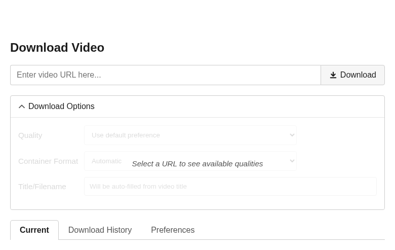

# VDL

A lightweight local video-downloader UI powered by yt-dlp. VDL provides a
browser interface for choosing formats, tracking concurrent downloads, pausing
or resuming work, importing local videos by dropping them onto the page,
organising entries with tags, and playing completed media.
Live progress arrives over Server-Sent Events without browser polling.
The UI and media APIs require a signed-in user.

[](https://github.com/mnemonic-bit/VDL/releases/latest)
[](https://github.com/mnemonic-bit/VDL/actions/workflows/main.yml?query=branch%3Amain+event%3Apush)
[](LICENSE)
[](https://github.com/mnemonic-bit/VDL/pkgs/container/vdl)



VDL is intended for a trusted local operator. It stores history and preferences
in SQLite, writes media to a configurable directory, supports light and dark
themes, and ships as a hardened non-root container for `linux/amd64` and
`linux/arm64`.

## Prerequisites

The recommended deployment needs Docker Engine with Compose. Podman works with
a Compose provider. Native use needs Python 3, the packages in
`requirements.txt`, and ffmpeg/ffprobe. A current Chromium, Firefox, or WebKit-
based browser is sufficient for the UI; browser playback still depends on codec
support in that browser.

The footer shows the release observed in the loaded UI and the release reported
by the active API. A mismatch asks you to refresh, which makes stale pages or
mixed deployments visible. The server also prints both values to its console
when it starts. Maintainers update the root `VERSION` file when cutting a
behavior-changing release according to the policy in `AGENTS.md`.

## Run with Docker Compose

The default deployment publishes port 5000 on all host interfaces and stores
media and SQLite state in independent named volumes:

```bash
docker compose up --build -d
docker compose ps
curl --fail --silent http://127.0.0.1:5000/api/health
```

Open <http://127.0.0.1:5000>. Set `VDL_PORT` to change the host port without
changing the container's health check:

```bash
VDL_PORT=8080 docker compose up --build -d
```

Stop containers with `docker compose down`. This preserves `vdl-data` and
`vdl-downloads`; `docker compose down -v` intentionally deletes both volumes.

### Watched ingest folder

Compose mounts the repository's `./ingest` directory at `/ingest` read-only in
the container. Copy a movie into that host directory and VDL will add a
validated copy to Download History after the file has remained unchanged for
60 seconds. The original stays in `./ingest`; remove it after the History item
appears to keep the periodic directory scan small. Receipts in SQLite prevent
an unchanged source from being imported again across restarts.

A file appearing under its final name cannot prove that its writer is done.
For a guaranteed completion handoff, copy under an ignored temporary name and
rename it only after the copy completes. Both paths must be in the ingest
directory so the rename is atomic:

```bash
cp /path/to/movie.mkv ./ingest/.movie.mkv.part
mv ./ingest/.movie.mkv.part ./ingest/movie.mkv
```

Direct copies are supported as a convenience: VDL requires three unchanged
observations spanning the settle period, compares device, inode, size, and
nanosecond modification time before and after copying, then validates the
copy with `ffprobe` before publishing it. A stalled writer can still exceed
any finite settle period, which is why the temporary-name protocol is the
strict option.

Set `VDL_INGEST_HOST_DIR` to bind another host folder. The container only needs
read and search permission on it:

```bash
VDL_INGEST_HOST_DIR=/srv/vdl/ingest docker compose up --build -d
```

`VDL_INGEST_SCAN_SECONDS` defaults to `10` and
`VDL_INGEST_SETTLE_SECONDS` defaults to `60`; both accept values of at least
one second. The scan is flat and uses directory metadata only, so idle cost is
proportional to the number of top-level inbox entries, not their byte size.
Hidden files, directories, symlinks, and names ending in `.part`, `.partial`,
`.tmp`, `.crdownload`, or `.download` are ignored. Native runs can opt in with
`VDL_INGEST_DIR`; leaving it unset disables the watcher.

### First sign-in and user access

The first visit asks you to set a password for the built-in `admin` account;
there is no preset password. Passwords are stored as one-way Werkzeug hashes.
After signing in, administrators can open **Settings → Users** to add normal or
administrator accounts, rename accounts, suspend or resume access, reset
passwords, and remove users. VDL prevents removal, suspension, or demotion of
the last active administrator. Renaming the bootstrap administrator does not
recreate an `admin` account on restart.

Podman can build and run the same image. A Compose provider (`podman-compose`
or Docker Compose) is required to use `compose.yaml` through Podman.

## Build and run directly

```bash
docker build --pull -t vdl:local .
docker run --rm -p 127.0.0.1:5000:5000 \
  -v vdl-downloads:/downloads -v vdl-data:/data \
  -v /srv/vdl/ingest:/ingest:ro vdl:local
```

The image contains yt-dlp `2026.08.19`, Deno `2.9.5`, EJS, curl-cffi,
ffmpeg, and ffprobe. It runs through tini as fixed UID/GID `10001:10001` and
does not contain Chromium or a browser automation package.

Published multi-platform images are available from GHCR:

```bash
docker pull ghcr.io/mnemonic-bit/vdl:latest
docker run --rm -p 127.0.0.1:5000:5000 \
  -v vdl-downloads:/downloads -v vdl-data:/data \
  -v /srv/vdl/ingest:/ingest:ro \
  ghcr.io/mnemonic-bit/vdl:latest
```

`latest` and `main` move. For reproducible deployment and rollback, use an
immutable `v<VERSION>` or full Git commit SHA tag from the
[package](https://github.com/mnemonic-bit/VDL/pkgs/container/vdl). Each
published platform image has GitHub-native provenance and an SPDX SBOM
attestation. Verify them with GitHub CLI:

```bash
gh attestation verify oci://ghcr.io/mnemonic-bit/vdl:v0.4.1 \
  --repo mnemonic-bit/VDL
amd64_digest=$(docker buildx imagetools inspect \
  ghcr.io/mnemonic-bit/vdl:v0.4.1 --raw | \
  jq -r '.manifests[] | select(.platform.architecture == "amd64") | .digest')
gh attestation verify "oci://ghcr.io/mnemonic-bit/vdl@$amd64_digest" \
  --repo mnemonic-bit/VDL \
  --predicate-type https://spdx.dev/Document/v2.3
```

## Optional PO-token provider

The BgUtils plugin is installed but disabled by default. To opt into its
isolated HTTP provider for the whole deployment, enable both the profile and
the application setting:

```bash
VDL_POT_PROVIDER_URL=http://bgutil-provider:4416 \
  docker compose --profile pot up --build -d
docker compose ps
docker compose logs --no-color vdl bgutil-provider
```

The provider has no host-published port. An empty `VDL_POT_PROVIDER_URL` means
plugin discovery is disabled and ordinary yt-dlp behavior is unchanged. PO
tokens may help with some YouTube responses, but they do not bypass access
controls and do not guarantee a successful download.

## Storage, backup, and upgrades

List the concrete named-volume locations with `docker volume inspect`. Back up
both volumes while VDL is stopped; `/data` contains users, password hashes,
session signing state, download history, and preferences, while `/downloads`
contains completed media and resumable partials.

Upgrades are immutable and reviewed: update image digests and dependency pins,
update `requirements-container.constraints`, regenerate
`requirements-container.txt` for both `manylinux_2_17_x86_64` and
`manylinux_2_17_aarch64`, run `./tests/container/check-lock.sh`, rebuild with
`--pull`, run the smoke checks, then recreate the service. Do not run
`yt-dlp -U`, `pip install -U`, or a Deno updater inside a running container.
Rollback starts the previous image against the same two volumes. Startup
automatically creates the access-control tables when upgrading an older
database.

Bind mounts are supported in place of the named volumes. The data and download
paths must already be writable by UID/GID 10001; the ingest path only needs to
be readable and searchable:

```bash
sudo install -d -o 10001 -g 10001 /srv/vdl/data /srv/vdl/downloads
sudo install -d -o "$(id -u)" -g "$(id -g)" -m 0755 /srv/vdl/ingest
docker run --rm -p 127.0.0.1:5000:5000 \
  -v /srv/vdl/data:/data -v /srv/vdl/downloads:/downloads \
  -v /srv/vdl/ingest:/ingest:ro vdl:local
```

The entrypoint fails with a clear storage-access error instead of starting a
server that cannot create its database, write media, or read the ingest mount.

## Network exposure

The UI accepts arbitrary operator-supplied URLs and requires a local VDL
account. The Compose port binds to `0.0.0.0`; use strong passwords and still
restrict access to a trusted network or place it behind a hardened reverse
proxy with request limits and an SSRF policy before exposing it publicly. The
login is an application access boundary, not protection against hostile URLs
submitted by an authorized user.

Only download media you are authorised to access and use. VDL does not bypass
DRM or access controls, and operators remain responsible for applicable site
terms and copyright law.

## Verification

The permanent regression suite is split into explicit tiers:

```bash
./tests/run-all.sh --unit
./tests/run-all.sh --browser
./tests/run-all.sh --media
./tests/run-all.sh --container
./tests/run-all.sh --all
```

`--all` is the release gate. See [`tests/README.md`](tests/README.md) for
dependencies, expected-failure policy, and the macOS manual check.

Build and inspect the local image with:

```bash
./scripts/container-smoke.sh --build
```

The script supports Podman through `CONTAINER_ENGINE=podman`. It checks the
runtime UID, pinned yt-dlp version, Deno, ffmpeg/ffprobe, Python extras, and the
absence of a browser. The external regression smoke is intentionally separate
from builds and health checks:

```bash
./scripts/network-smoke.sh |& tee "vdl-network-smoke-$(date -u +%Y%m%d).log"
```

It records the UTC date, image, URL, verbose yt-dlp diagnostics, and result for
the representative `G3jvn7n-68Y` failure. Since public sites change, a later
unrelated removal or restriction should be recorded rather than treated as a
container build failure.

Inspect image health with `docker inspect --format '{{json .State.Health}}'`
or the equivalent Podman command. `/api/health` intentionally remains
unauthenticated for runtime probes, exposes no library data, and does not call
YouTube or the optional provider.

## Native development

```bash
python3 -m venv .venv
source .venv/bin/activate
python -m pip install --upgrade pip -r requirements.txt
python vdl.py
```

Native development defaults to <http://127.0.0.1:5000>. ffmpeg remains an
external system dependency.

## Firefox authenticated downloads

VDL Companion lets a signed-in user send the current Firefox page and the
cookies applicable to that page to VDL with one explicit toolbar click. This
is useful for media the site exposes only to the user's legitimate browser
session. It does not bypass DRM, CAPTCHA, bot protection, geographic or account
authorization, or a site's terms.

Pairing requires desktop Firefox 140 or later and a browser-visible VDL origin
using HTTPS with a certificate trusted by that Firefox installation. VDL does
not terminate TLS; put it behind an HTTPS reverse proxy and forward requests
to the normal VDL HTTP listener. The public URL may use a non-default port, for
example `https://vdl.example:8443`, but it must have no path prefix. Install the
proxy's private certificate authority in Firefox when using an internal CA.
Plain HTTP, including loopback and LAN addresses, cannot pair in the release
extension.

For a typical reverse proxy, preserve the original request path and host, allow
long-lived `/api/events` responses without buffering, and proxy the fixed XPI
and `/api/extension/*` paths unchanged. No forwarded-scheme trust setting is
needed for pairing: Settings uses the browser's authoritative
`window.location.origin`.

To use the companion:

1. Open VDL Settings → Browser Extension and install the bundled XPI. Firefox
   always displays its own Add confirmation.
2. Create and copy the five-minute pairing string, paste it into the extension
   onboarding page, verify the HTTPS origin, and confirm pairing.
3. Open a signed-in video page and click **Download current page with VDL**.
   Firefox asks for access the first time each website host is used.
4. Install a newer bundled XPI when Settings reports an update. The stable
   add-on identity updates the existing installation in place.
5. Use **Revoke** in VDL Settings or **Unpair** in the extension options to end
   a connection. Signing out of the VDL web UI alone does not revoke it.

Firefox Containers are isolated by the clicked tab's cookie store. Private
windows, partitioned/FPI cookies, related identity-provider domains,
localStorage, custom browser headers, Android/iOS Firefox, and non-Firefox
browsers are not supported. If an authenticated download is cancelled or VDL
restarts, revisit the signed-in source page and click the companion again;
ordinary Continue is intentionally unavailable because cookies are never
persisted. VDL stores the source URL and its query in the downloads database,
while browser cookies remain in the live worker's memory only. See
[the companion privacy notice](browser-extension/PRIVACY.md) for the complete
data-handling disclosure.

## Project status and support

VDL is a sole-maintainer project, released under the [MIT License](LICENSE).
Public issues are available through structured forms for reproducible bugs and
feature requests. Triage and maintenance are best effort, with no guaranteed
response or resolution time; duplicate, unsupported, or insufficiently
actionable reports may be closed. External pull requests and shared governance
are not part of the current maintenance model.

Report vulnerabilities privately according to [SECURITY.md](SECURITY.md), not
through a public issue. Maintainer-only GitHub setup and release safeguards are
recorded in [.github/REPOSITORY_SETTINGS.md](.github/REPOSITORY_SETTINGS.md).

## Future browser provider

This release is browser-ready, not a browser image. Reconsider Chromium only if
a current pinned yt-dlp with EJS, Deno, curl impersonation, and ffmpeg still
fails, the optional provider is demonstrably reached and remains insufficient,
the URL works from a browser on the same network, and the cause is genuinely
browser-solvable rather than DRM, authentication, rate limiting, or removal.
That work needs a separate design for browser concurrency, timeouts, sandboxing,
memory, cleanup, ephemeral cookies, and secret redaction.
